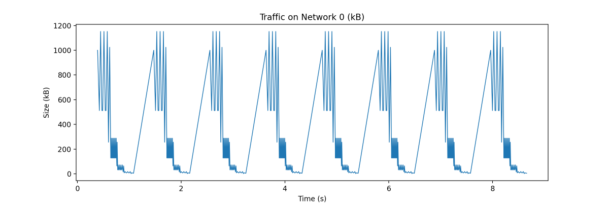
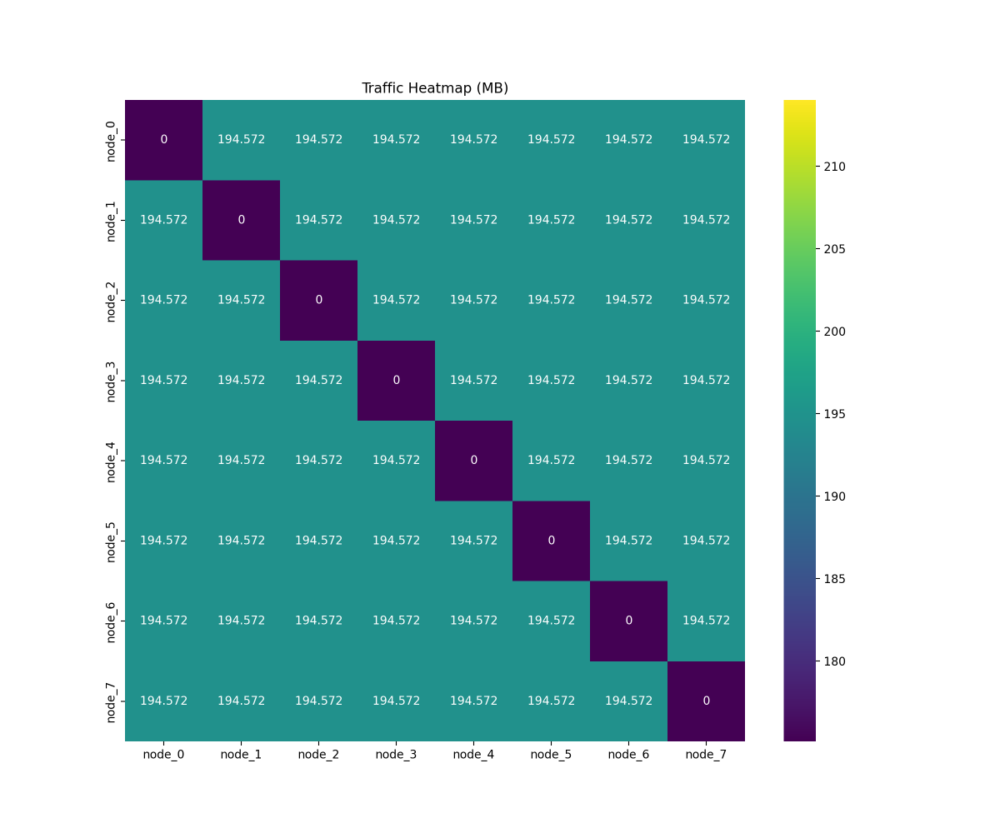

# AdpartSim

AdpartSim is a **scalable** simulation tool platform, through which some interfaces it defines can easily achieve simulation of the computing process and communication process. Through the framework of AdpartSim, it is possible to implement customized computing simulations, network topologies (*there are also some commonly used network topologies that have been defined*), collective communication algorithms, and parallel optimization strategies. In the future, it can support various network types as well as the RDMA network commonly used in data centers (*we are currently working on related tasks*). It should be noted that AdpartSim supports **hierarchical networks**. When optimizing the collective communication library in the training process of LM, we can carry out communication tasks based on the conditions of multiple levels of networks. Hierarchical networks are very common network architectures in some new data centers, which is very helpful for accelerating collective communication in the training process of LM.


## QUICKSTART

### 1. Requirement

1. It is **recommended** to use Ubuntu-22.04 or a newer version.
2. **Ensure** that the GCC version is above 10 to support the C++20 features.
3. **Ensure** that the CMake version is not lower than 3.22.
4. The dependencies for apt and pip have been installed according to the requirements of [USER_GUIDE](./docs/USER_GUIDE.md).

### 2. Compile

The following command will automatically download missing components and perform compilation and verification tasks. The first execution may take a longer time, depending on your network.

```bash
bash ./build.sh -a
```

### 3. Run AdpartSim

The compiled products are located in the `build/` directory. You can refer to the configuration file format in the `example/` path to create your own running parameters. Then, you can use the following command to complete the operation. For more details, please refer to the [TUTORIAL](./docs/TUTORIAL.md)

```bash
./build/AdpartSim --input=path/to/config.json --output=path/to/result
```

### 4. Result

You can obtain files such as the `timeline.json` file (view the timeline using [Perfetto](https://ui.perfetto.dev/) or [Tracing](edge://tracing/)), `summary.csv` file,  `traffic_heatmap.csv` file. If you need to plot the results, you can use the script located at `script/draw_result.py` for simple processing.

```bash
python3 ./script/draw_result.py path/to/result
```

Of course, you can also write your own script to handle the raw CSC result files.

- **Time Line**



- **Traffic**


- **Traffic Heat Map**



## ADDITION

AdpartSim inspiration is derived from [ASTRA-sim](https://astra-sim.github.io/), This project is actively under development. If you encounter any [issues](https://github.com/zzudongxiang/AdpartSim/issues) during use, you can submit an issue to seek answers, or help us improve it. We welcome everyone to engage in discussions.
